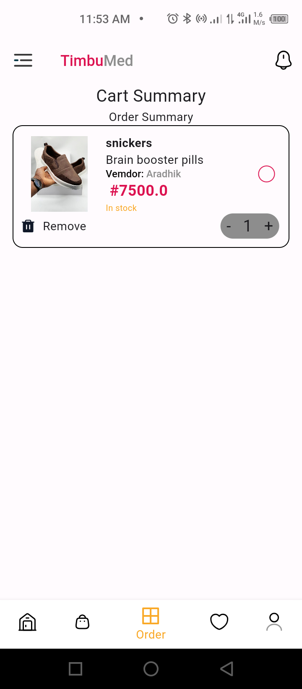

# hng_stage_two

A simple application that demonstrates list of product from an API.

## Screenshots




## Apk Download
- [Download link](https://drive.google.com/file/d/1FaMQaapSSSi-UNgq0Qyf4yFDXbzkde8N/view?usp=sharing)

## Appetize Link
- [Download link](https://appetize.io/app/b_irob2cz3rzlj3pttmvsomdxrne)

### Prerequisites

You need to have the following software installed on your machine:

- [Dart SDK](https://dart.dev/get-dart)
- [Flutter SDK](https://flutter.dev/docs/get-started/install) (if using Flutter)

### Installing

1. Clone the repository:

```bash
git clone https://github.com/Aradhik11/hng_timbu.git
cd hng_timbu.git


