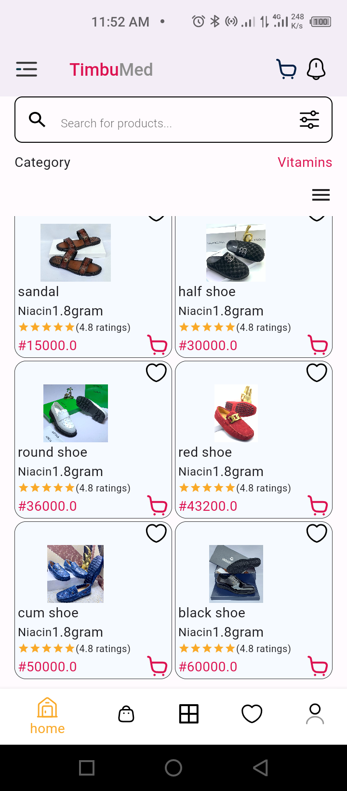

# hng_stage_two

Designing apllication from the designer.

## Screenshots




## Apk Download
- [Download link](https://drive.google.com/file/d/1mQblc6_DcmUQCcsNPeI4NAMnZbCl2BOr/view?usp=sharing)

## Appetize Link
- [Download link](https://appetize.io/app/b_uopbgqei7cl4dmj6vvhj7laite)

### Prerequisites

You need to have the following software installed on your machine:

- [Dart SDK](https://dart.dev/get-dart)
- [Flutter SDK](https://flutter.dev/docs/get-started/install) (if using Flutter)

### Installing

1. Clone the repository:

```bash
git clone https://github.com/Aradhik11/hng_timbu.git
cd hng_timbu.git


